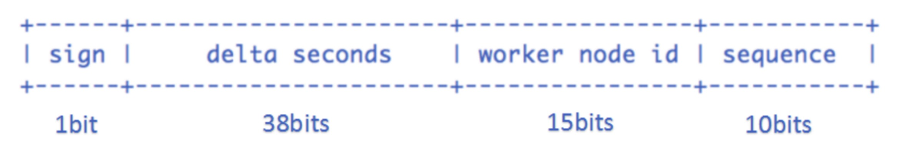

### 分布式唯一id：snowflake算法

twitter开源，github地址：https://github.com/twitter-archive/snowflake

核心思想是：使用41bit作为毫秒数，10bit作为机器的ID（5个bit是数据中心，5个bit的机器ID），12bit作为毫秒内的流水号（意味着每个节点在每毫秒可以产生 4096 个 ID），最后还有一个符号位，永远是0

使用：
    
    //获取一个id接口
    long snowflakeNextId()
    //获取count个id接口
    long[] snowflakeNextIds(int count) throws InvalidSystemClock;
    
优点：

    快,一秒大约可生成。
    没有啥依赖，实现也特别简单。
    知道原理之后可以根据实际情况调整各各位段，方便灵活。

缺点：

    只能趋势递增。（有些也不叫缺点，网上有些如果绝对递增，竞争对手中午下单，第二天在下单即可大概判断该公司的订单量，危险！！！）
    依赖机器时间，如果发生回拨会导致可能生成id重复。
    下面重点讨论时间回拨问题。